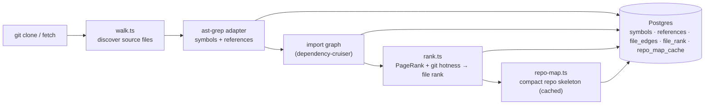

# `repo-intel` — the codebase indexer

`repo-intel` reads a cloned repository **once on clone** (and incrementally on
fetch, keyed by file content hash) and turns it into queryable facts: symbols,
the import graph, a PageRank-based file importance score, and a compact **repo
map** (the project skeleton). On a review it is only **read** — the index is
already computed, so adding context to a prompt costs no analysis at request time.

This is **starter infrastructure**: it works from day 1 (the **Indexed** badge),
but you don't write it. Course lessons build features _on top_ of its facade —
Blast Radius (L04), Conventions samples (L02), Onboarding reading-path (L05),
the Phantom-API gate (L06) — by calling `repoIntel.*`, not by re-indexing.

## Pipeline

Full vs incremental indexing lives in `pipeline/{full,incremental}.ts`; an
unindexed or partially-indexed repo degrades gracefully (the facade returns empty
results rather than throwing).

## Facade (`repoIntel.*`)

Everything downstream reads through one facade (`service.ts`) so consumers never
touch the pipeline internals:

- `getRepoMap(repoId)` → the cached repo skeleton (fed into the **review prompt**).
- `getFileRank(repoId, files)` → importance percentile per changed file.
- `getCallerSignatures(repoId, files, limit)` → callers of changed symbols.
- `getBlastRadius(repoId, files)` → impacted symbols / callers (used by L04).
- `getUnresolvedReferences(repoId, …)` → phantom-symbol detection (used by L06).
- `getConventionSamples(repoId)` → top-ranked files for convention extraction (L02).

In the starter, only `getRepoMap` / `getFileRank` / `getCallerSignatures` are
wired — into `modules/reviews/run-executor.ts`, which adds the repo map and a
high-blast-radius note to the prompt. Toggled by `REPO_INTEL_ENABLED` (global)
and a per-agent `repo_intel` flag.

## Routes

- `GET /repos/:id/index-state` — index status (drives the **Indexed** badge).
- `POST /repos/:id/resync` — enqueue a re-index.
